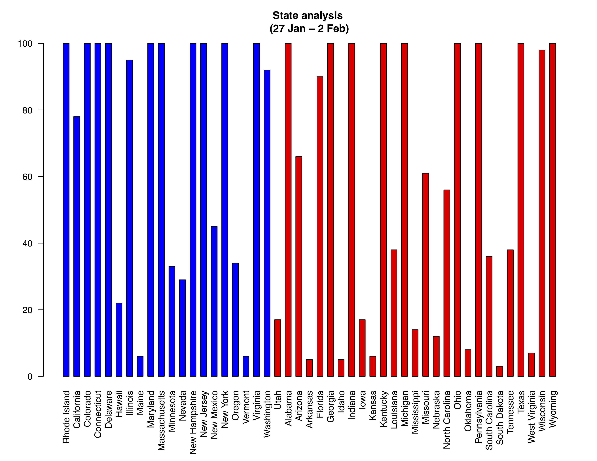
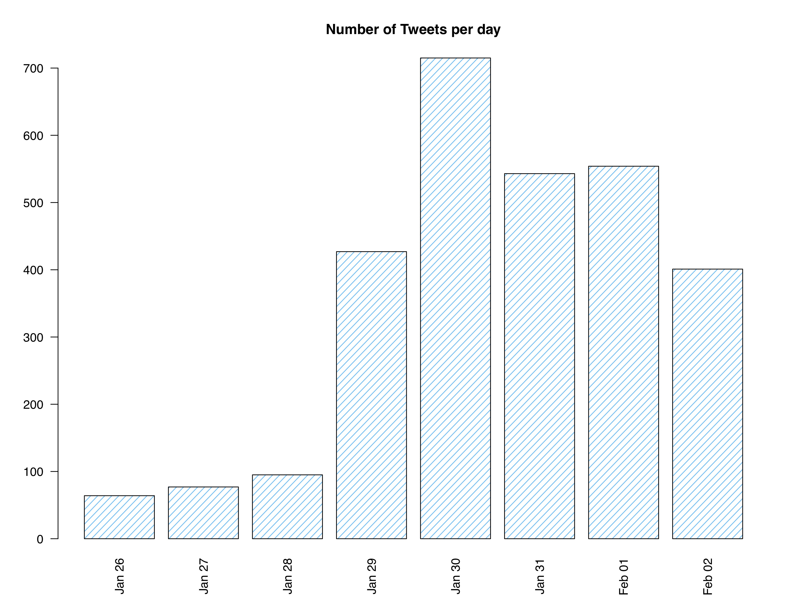

# Global warming

In recent decade, climate change became a topic of many political and social conversations. The principle of global warming and the heating up of the layers of atmosphere have been discussed a lot and public reactions  about its effects is increasing specially in social media. This project will discuss the social aspects of global warming by observing the users tweets in twitter including `#globalwarming`. Gathering information about the number of tweets in different states, the state political party and the popularity of tweets will provide us with informations we can use to analyze the social reaction to global warming.

The datas needed for this project where gathered from the available API from Twitter using Python and json. The provided plots will show the followings: 

  - The correlation between the number of tweets in each state and the political party of the state
  - The frequency of tweets in different days of the week
  

